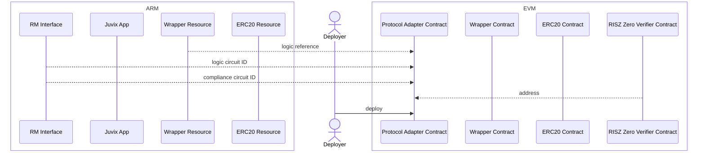
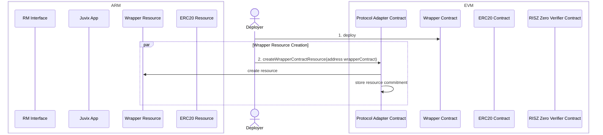
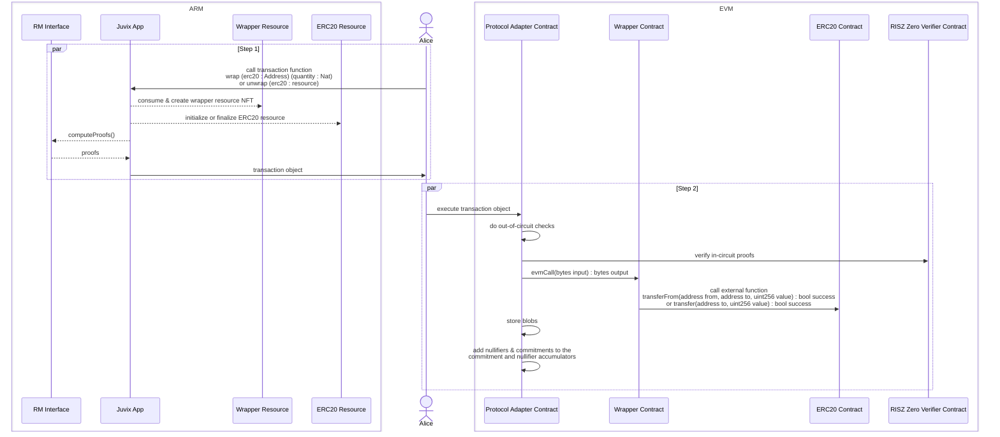

# EVM Protocol Adapter

## Protocol Adapter Deployment

## Wrapper Contract Deployment

## Transaction with EVM call

### Limitations
- A wrapper contract must be deployed by a 3rd party
- 1 EVM call per wrapper contract per block
- EVM call return values must be known at proving time