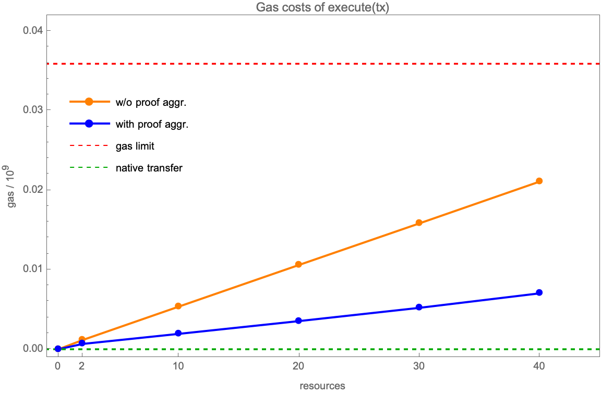

[](https://github.com/anoma/pa-evm/actions/workflows/contracts.yml) [](https://soldeer.xyz/project/anoma-pa-evm) [](https://raw.githubusercontent.com/anoma/pa-evm/refs/heads/main/bindings/LICENSE)
[](https://github.com/anoma/pa-evm/actions/workflows/bindings.yml) [](https://crates.io/crates/anoma-pa-evm-bindings) [](https://raw.githubusercontent.com/anoma/pa-evm/refs/heads/main/bindings/LICENSE)

# Anoma EVM Protocol Adapter

A protocol adapter (PA) contract written in Solidity enabling Anoma Resource Machine transaction settlement on EVM-compatible
chains.

## Project Structure

This monorepo is structured as follows:

```
.
├── audits
├── bindings
├── contracts
├── example-tx-generation
├── Cargo.lock
├── Cargo.toml
├── README.md
└── RELEASE_CHECKLIST.md
```

The [contracts](./contracts/) folder contains the contracts written in [Solidity](https://soliditylang.org/) as well as [Foundry forge](https://book.getfoundry.sh/forge/) tests and deploy scripts.

The [bindings](./bindings/) folder provides [Rust](https://www.rust-lang.org/) bindings for the conversion of Rust and [RISC Zero](https://risczero.com/) types into [EVM types](https://docs.soliditylang.org/en/latest/types.html) and exposes the deployment addresses on the different supported networks using the [alloy-rs](https://github.com/alloy-rs)
library.

The [example-tx-generation](./example-tx-generation) folder contains a binary to generate example transactions with aggregated and non-aggregated proofs as `.bin` files for testing purposes, which can be used for testing purposes, e.g., in [./contracts/test/examples/transactions/](./contracts/test/examples/transactions/).

## Audits

Our software undergoes regular [audits](./audits/):

1. Informal Systems

   - Company Website: https://informal.systems
   - Commit
     ID: [fc69013e7bc2db1bddf6ef6936e8bf03d14f2963](https://github.com/anoma/pa-evm/tree/fc69013e7bc2db1bddf6ef6936e8bf03d14f2963)
   - Started: 2025-10-13
   - Finished: 2025-10-31
   - Last revised: 2025-11-07

   [📄 Audit Report (pdf)](./audits/2025-11-24_Informal_Systems_RISC_Zero_RM_&_EVM_Protocol_Adapter.pdf)

2. Nethermind

   - Company Website: https://www.nethermind.io/nethermind-security
   - Commit
     ID: [fee4f47050689b82473e9a3198e7a2065becb3fb](https://github.com/anoma/pa-evm/tree/fee4f47050689b82473e9a3198e7a2065becb3fb)
   - Started: 2025-10-07
   - Finished: 2025-11-13

   [📄 Audit Report (pdf)](./audits/2025-11-13_Nethermind_RISC_Zero_RM_&_EVM_Protocol_Adapter.pdf)

## Security

If you believe you've found a security issue, we encourage you to notify us via Email
at [security@anoma.foundation](mailto:security@anoma.foundation).

Please do not use the issue tracker for security issues. We welcome working with you to resolve the issue promptly.

### Benchmarks

The following benchmark shows the transaction execution costs without and with proof aggregation for the current
protocol adapter implementation:


