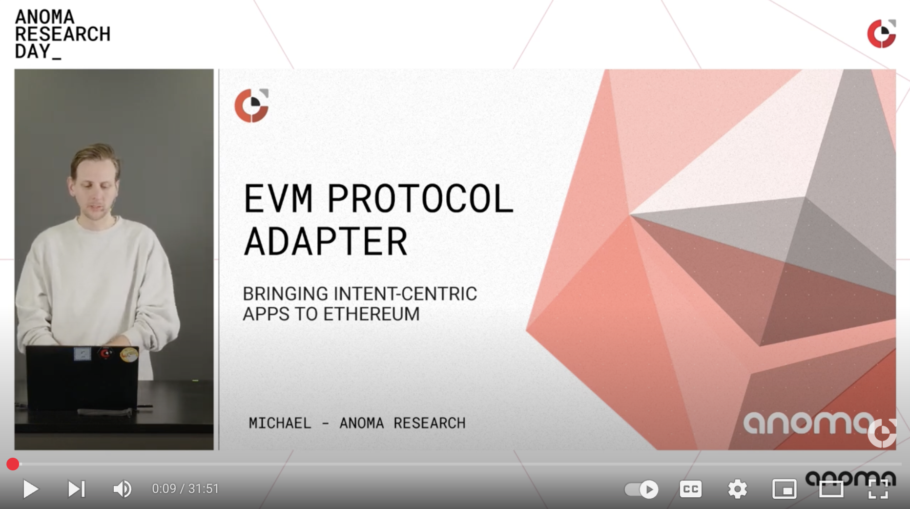

# EVM Protocol Adapter

For more information on the EVM protocol adapter, find the related

- [Anoma Research Day talk](https://www.youtube.com/watch?v=rKFZsOw360U)
- [Anoma Specs Page](https://specs.anoma.net/latest/arch/integrations/adapters/evm.html)

<div align="left">
  <a href="https://www.youtube.com/watch?v=rKFZsOw360U">
     
  </a>
</div>

> [!WARNING]  
> This repo features a prototype and is work in progress. Do NOT use in
> production.

## Installation

1. Get an up-to-date version of [Foundry](https://github.com/foundry-rs/foundry)
   with

   ```sh
   curl -L https://foundry.paradigm.xyz | bash
   foundryup
   ```

2. Clone this repo and run
   ```sh
   forge install
   ```

## Usage

### Tests

Run

```sh
forge test
```

### Deployment

To simulate deployment on sepolia, run

```sh
forge script script/Deploy.s.sol:Deploy \
   --rpc-url sepolia
```

Append the

- `--broadcast` flag to deploy on sepolia
- `--verify` flag for subsequent contract verification on Etherscan
- `--account <ACCOUNT_NAME>` flag to use a previously imported keystore (see
  `cast wallet --help` for more info)

#### Block Explorer Verification

For post-deployment verification on Etherscan run

```sh
forge verify-contract \
   <ADDRESS> \
   src/ProtocolAdapter.sol:ProtocolAdapter \
   --chain sepolia \
   --constructor-args-path script/constructor-args.txt
```

after replacing `<ADDRESS>` with the respective contract address.

## Benchmarks

Parameters:

- Commitment accumulator `treeDepth = 32`


